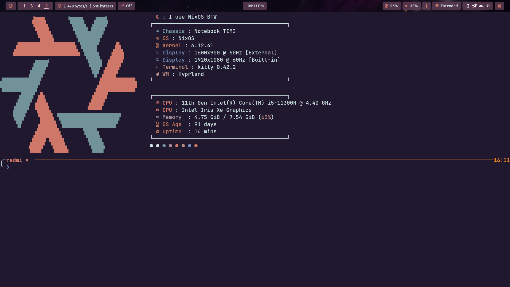

<div align="center">
  
  <br>
  <h1>Rishabh's Flakes</h1>
  <p>
    <a href="https://github.com/Rishabh5321/dotfiles">
      
    </a>
    <a href="https://nixos.org">
      
    </a>
    <a href="https://github.com/Rishabh5321/dotfiles/blob/main/LICENSE">
      
    </a>
    </a>
     <a href="https://github.com/Rishabh5321/dotfiles/commits/main">
      
    </a>
  </p>
  <br>
</div>

# NixOS Configuration for Laptop and Server

This repository contains the NixOS configuration for both a laptop and a server. The configuration is managed using Nix flakes, which allows for reproducible and declarative system setups.

<div align="center">

## 🖼️ Configuration Showcase

<p align="center">
  
  
  
  
  
</p>
</div>

## Table of Contents

- [Overview](#overview)
- [Directory Structure](#directory-structure)
- [Features](#features)
- [Inputs](#inputs)
- [Outputs](#outputs)
  - [Packages](#packages)
  - [Formatter](#formatter)
  - [Overlays](#overlays)
  - [NixOS Configurations](#nixos-configurations)
- [Usage](#usage)
- [Configuration Details](#configuration-details)
  - [Common Configuration](#common-configuration)
  - [Host-Specific Configuration](#host-specific-configuration)
- [Dependencies](#dependencies)
- [License](#license)

## Overview

This configuration is designed to be modular and reusable across different machines. It includes settings for both system-wide configurations and user-specific home-manager configurations. The setup leverages various NixOS modules and community contributions to enhance functionality and aesthetics.

## Directory Structure

The repository is organized as follows:

```bash
. ├── containers/           # Containerized applications (e.g., Jellyfin, Plex, Sonarr)
  ├── hosts/                # Host-specific configurations
  │ ├── dell/               # Configuration for Dell systems
  │ │ ├── configuration.nix # System-wide configuration for Dell
  │ │ └── home.nix          # User-specific configuration for Dell
  │ └── redmi/              # Configuration for Redmi systems
  │ ├── configuration.nix   # System-wide configuration for Redmi
  │ └── home.nix            # User-specific configuration for Redmi
  ├── modules/              # Modular configurations for desktop environments and tools
  │ ├── desktop/            # Desktop environment configurations (e.g., GNOME, KDE, Hyprland)
  │ ├── user/               # User-specific configurations (e.g., Neovim, Alacritty, Zsh)
  │ └── system/             # System-wide NixOS modules (e.g., Bluetooth, Gaming, Virtualization)
  ├── overlays/             # Custom Nixpkgs overlays
  ├── pkgs/                 # Custom packages
  ├── screenshot/           # Screenshots of the system in action
  ├── wallpapers/           # Collection of wallpapers
  ├── flake.lock            # Nix flake lock file
  ├── flake.nix             # Nix flake configuration
  ├── LICENSE               # License file
  └── README.md             # This documentation
```

## Features

- **Desktop Environments**: Supports multiple desktop environments, including:
  - Hyprland
  - GNOME
  - KDE
  - XFCE
  - Budgie
  - Cinnamon
  - Pantheon
  - Cosmic (WIP)
- **Containerized Applications**: Pre-configured containers for media servers and download managers:
  - Jellyfin
  - Plex
  - Sonarr
  - Radarr
  - qBittorrent
  - Portainer
- **Home Manager**: User-specific configurations for tools like:
  - Neovim
  - Alacritty
  - Zsh
  - Fastfetch
  - Spicetify
- **Custom Packages**: Includes custom packages and overlays for additional functionality.
- **Theming**: Styling and theming support via `stylix` and custom GRUB themes.

---

## Inputs

The following inputs are used in this configuration:

- `nixpkgs`: The main NixOS package repository (unstable branch).
- `nixpkgs-stable`: The stable branch of the NixOS package repository.
- `home-manager`: Manages user environments using Nix.
- `stylix`: Provides theming and styling for NixOS.
- `spicetify-nix`: Customizes Spotify with themes and extensions.
- `better-control`: Custom flake for better control utilities.
- `zen-browser`: A minimalistic browser configuration.
- `nix-flatpak`: Integrates Flatpak applications with NixOS.
- `darkmatter-grub-theme`: A GRUB theme for a dark aesthetic.
- `nix-gaming`: Optimizations and packages for gaming on NixOS.
- `seanime`, `thorium`, `akuse-flake`: Custom flakes for additional functionality.

### Packages

Packages are defined for all supported systems (`x86_64-linux`). These packages can be imported and used within the NixOS configurations.

### Formatter

The formatter used in this configuration is `alejandra`, which ensures consistent code style across the Nix expressions.

### Overlays

Custom overlays are defined to extend or modify the NixOS package set. These overlays are imported from the `./overlays` directory.

### NixOS Configurations

Two NixOS configurations are defined:

- **redmi**: Configuration for a Redmi laptop.
- **dell**: Configuration for a Dell server.

Each configuration includes system-wide settings, theming, and user-specific configurations managed by `home-manager`.

## Usage

To use this configuration, clone the repository and navigate to the desired host configuration:

  ```bash
  git clone https://github.com/Rishabh5321/dotfiles
  cd dotfiles
  ```

Apply the configuration to a specific host:

  ```bash
  sudo nixos-rebuild switch --flake .#redmi
  ```

Replace redmi with dell for the server configuration.

Important Warning:
Ensure that you modify the hardware configuration according to your computer's specifications. The provided configurations are tailored for specific devices (e.g., redmi or dell), and using them without adjustments may lead to compatibility issues or improper system behavior. Always review and customize the hardware settings (e.g., storage, GPU, etc.) to match your system.

For example, check and update files like hardware-configuration.nix or any device-specific settings in the nixos directory before applying the configuration.

## Configuration Details

### Common Configuration

The `commonConfig` function generates a common set of configurations for all hosts. It includes:

- Special arguments passed to modules.
- System-wide modules like `stylix`, `nix-flatpak`, and `home-manager`.
- User-specific configurations managed by `home-manager`.

## Host-Specific Configuration

Each host has its own directory under `./nixos/<hostname>`, containing:

- `configuration.nix`: System-wide configuration.
- `home.nix`: User-specific configuration managed by `home-manager`.

## Dependencies

This configuration relies on several external inputs and modules. Ensure that all dependencies are available and properly configured before applying the configuration.

## Screenshots 🖼️

Here are some screenshots of the system in action:

---

## License

This project is licensed under the MIT License. See the [LICENSE](LICENSE) file for details.

---

For more information on NixOS and home-manager, refer to the official documentation:

- [NixOS Manual](https://nixos.org/manual/nixos/stable/)
- [Home Manager Manual](https://nix-community.github.io/home-manager/)
